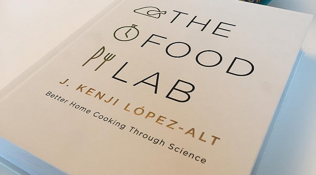
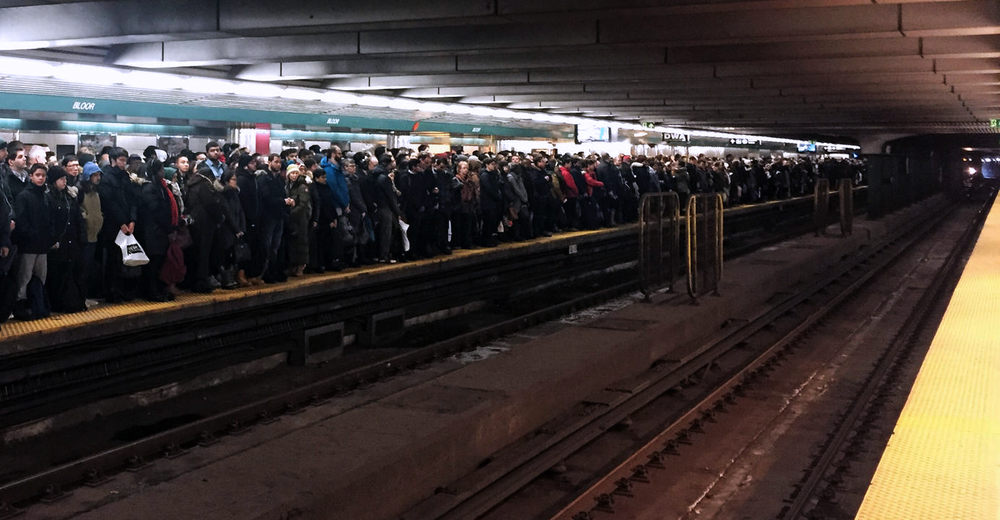
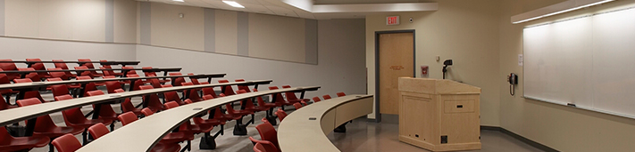

Commutes have been especially taxing on me. It was something that I wanted to avoid as much as possible and further steered me into wanting to go to a school that's closer perhaps. Anything to get me out of my program. Using that time to read lecture material or even do readings beforehand felt difficult to pay attention to, especially just waking up for the day, and so I felt like I wasn't using that commuter time wisely one bit. Time to me is important to use in some way, and it really bothered me how much I wasn't using it.

*The Food Lab: Better Home Cooking Through Science, J. Kenji López-Alt*

I picked up a book that was simple enough in language to follow on a commute and still learn something. I wasn't going to be reading this book at home because that time is more meant for other things, so to fill my commuter time this way felt refreshing. And interestingly, the content of it does tie into my program which touches on food science at some point as well. A two birds one stone sort of deal perhaps?

I don't read it every commute though. Sometimes I'd be too mentally exhausted or simply not feeling it, and to me, that time "wasted" is fine because it isn't necessarily "wasted", it's time used to relax and let myself rest and enjoy a little break before I have to get to some sort of school work or personal errand as soon as I get off the bus or train. Those times where I am alert and need something to do during my commutes however, it felt good to have something ready to go on my phone with an e-book to pass the time. 

I still hate this side of commutes though.

Other than finding out how to make more use out of my commutes, I found a new appreciation for the material learnt in school. In the scope of Nutrition and Food, this is quite controversial for me because I used to really enjoy the sciences of biology and chemistry involved in nutrition which heavily preface my program. This all shifted to really enjoying the sociology, anthropology, and psychology involved in nutrition; all of which I never thought to enjoy. I found a this new appreciation all because of the classes provided to me that facilitate this this sort of learning and thinking. I would have never thought to look up any of these facets to nutrition on my own volition to purposely critically think about them the same way school has challenged me to. 

This goes for any sort of class however that's within the scope of liberal arts. Taking lower liberals has been the biggest pleasure to partake in, in my past few terms here because they're all of content I would have never known about had I not taken their respective courses. To learn from someone who is exceptionally knowledgeable in their field is some of the greatest joy I find in being a university student. It put me in a place to realize the worth of what I'm paying and using my time for. It's nothing but wisdom.

This is all of significance to me because I have always had some sort of aversion to school. It always felt that the knowledge was pointless, that it was all for a grade, but I don't quite think this way anymore. It's all to grow yourself. And so I take this value going forward with school, especially after receiving my RTW status, that I want to better myself through life experience and knowledge, going through the motions of university.

With that, success will come.
