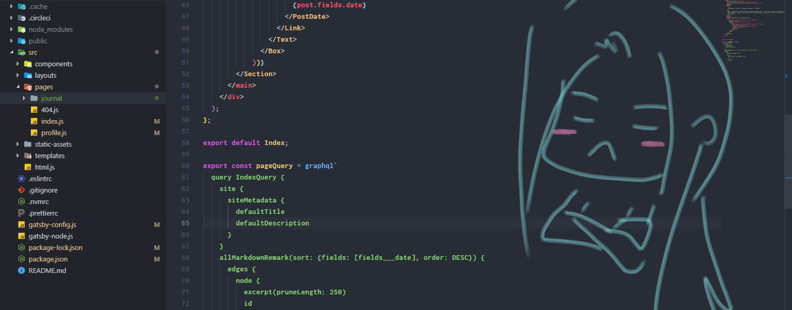

Waiting out the summer, trying to figure out what I was going to do after receiving my RTW status was very lax. I knew what was coming as early as signing my probation contract for my second term because I was already mentally clocked out of caring for school and didn't bother to do anything to make it better. I simply wasn't in the right place with what my purpose for being in Nutrition and Food was. I still somewhat did the bare minimum to pass courses. For some reason, that flame was still lit, albeit dim. It was for the purpose of setting myself for making a comeback for the semester. Perhaps I'd find myself at least a half or a third of the way there, that that flame would really ignite and I'd somehow pull myself through the semester in the end. This didn't happen. By the end, I was even more so determined to go into graphic design, and it was a huge sigh of relief that I didn't have to deal with the anxiousness of school anymore.

But what was I going to do with my time going forward? I didn't even take up a job or volunteer work like I told myself I would. I wasn't very proactive at all - it was a very lax period as I said, and in retrospect, I don't even regret the time wasted. Because I was proactive in one thing, and that was looking at my Plan B that was so clearly paved out to me by now, to start pursuing graphic design. 

What I've always been particularly interested in is web development and UI, maybe a little bit of iconography, but not branding or anything. Making layouts for projects of any sort in school and as a hobby has always been incredibly enjoyable to me, and so I thought to apply this enjoyment to making a potential career out of it. I started working towards it, and began curating a portfolio over the summer to shoot for graphic design. 

It did nothing but make me frustrated.

I quickly remembered why this wasn't my Plan A career path to begin with. I took on the task of learning more CSS and JavaScript. The problems that appear in code that one has to then solve gave me no gratification at all. Maybe for some it does, maybe for some it doesn't and they still love it, but the latter was far from me. It just reminded me how much I hated working with code, how could I have forgotten?

And to add it to the scope of thinking about having a career with this? No thank you. I hated the thought of having to do with very work for *someone else*. To think up a design for someone else, to have it undergo revisions for their sake, to solve frustrating coding problems for them? No.

And this could all be looked at differently quite frankly, that doing the work for someone else would also be for myself too - the experience gained in order to better my work, become more efficient at code, expand my scope of design, etcetera, etcetera. This all didn't sound too convincing either, because in the back of my mind, I was able to answer, "Yes, I'd better myself this way" to all those arguments had I applied them to the scope of Nutrition and Food. That's the sort of field I'd prefer to do for someone else.

If someone were to ask me to help them with designing something, I still find enjoyment in suggesting design ideas and sharing what I know of the elements and principals of design, but this sort of zest goes even further when faced with the topic of Nutrition and Food. I feel an even greater enjoyment in being able to help people reframe their current understanding of nutrition, and even teach of the real concerns surrounding it. With all the misinformation about nutrition that circulates social media today, it excites me to be a part of an ever changing science that could very well prove certain misinformation to one day be true.

So in my lax summer of doing what seems like mostly wasted time, I figured out my plans going forward. I figured out that I am going to get my feet back on the ground and go through the motions of Nutrition and Food; A program that fosters knowledge I would have never known had I not have been given the opportunity to learn from professors in a university setting.
