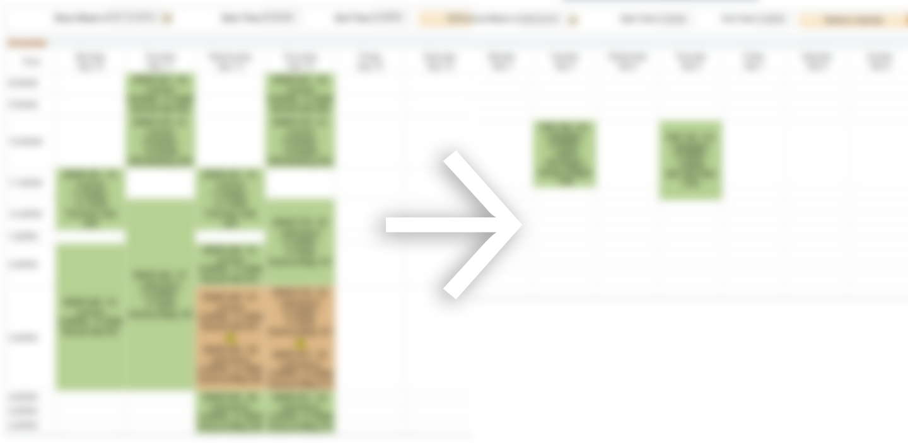

I came about being RTW for a reason that even my academic advisor was surprised to listen to, and it was my concrete thinking goal of wanting to have a stable career laid out for me at least before my late 20s. I was torn between a program that I was already in, Nutrition and Food, that would take 5 years at least including an internship period and testing period for dietitian licensure; and a graphic design program at Seneca that would take 3 years at most. Approaching my mid 20s, it was clear to me that I should just shoot for graphic design. At least that would guarantee my goal.

While this facilitated the reasoning for my short comings in my first year, I still struggled with trying to intake the university life. It was nothing to do with being a mature student, or that the work was necessarily hard. I just forgot how to do school. I've been out of school for so long, and with a background of being sort of a rebel with going about high school, in that I would drop complete focus in courses I had a disinterest in, or find other simpler ways to go about obtaining a compulsory credit, I learnt that that game wouldn't work here. There are no substitutes or other means of getting to my goal career of being a dietitian now. It's just one road.

Maybe I just never knew how to do school in the first place; Maybe I slightly do. I took all of my prerequisites for Nutrition and Food through the Independent Learning Centre (ILC) way after high school and found that I do have the discipline that I thought I didn't have, and that I do have the capability to get good grades in classes I have a disinterest in when I put all of the hard work in. But the problem was that of course it was simple to achieve this with ILC, because all I ever did was focus on one course at a time.

I knew I can make the grades happen, but I didn't know just yet if I can do that in university, where you'd typically be taking 5 courses at a time. It felt apparent that I couldn't achieve this after my first semester. I focused on only 2 out of 5 courses. While I still passed the ones I hadn't focused on, they surely didn't reflect the grades I know I'm capable of. It was like high school all over again. I focused only on what I enjoyed.

This term however taught me that tunnel-visioning the way I always had in school is not always a problem; History doesn't always have to repeat itself. This term worked exceptionally well for me with having only 3 courses to worry about meeting deadlines for. It was a bit slow at times in which I felt a 4th course could have filled my time comfortably as well; It just depends on the demands of the other courses and how it all fits together. Overall, it was the realization that having many courses to deal with just isn't for me given how much I value time to myself over time for school work. This is how I plan to go about structuring future terms.

Going back to my initial dilemma, I don't think so concretely about my goal of being a dietitian by my late 20s now. I always go about life feeling that there is a reason for everything. There's a reason that I went through this past hardship and there is a reason that I sacrificed about $200 out of pocket to pay for this course just so I could get back on track and not be set back by a full year of sitting out 12 months. Even if I may be set back somewhat at this point, I'm still pursuing my initial program choice of Nutrition and Food. Albeit more of a Plan C now with my adjusted goal of simply getting it done.