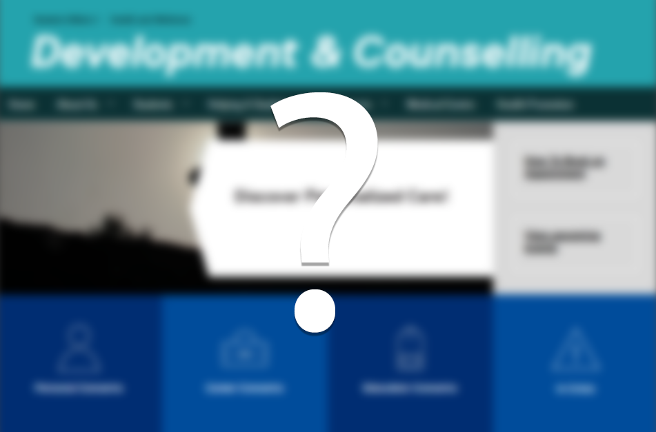

The thing about being told that the resources are there for counselling here at Ryerson is that they're there, but they're "not." I'm not someone who wants to share my problems with someone who hardly even knows who I am. What good is talking to someone who only knows me as far as the 30 minutes we've met? What good is it telling them my problems to which they respond with a generic reply that I am already aware of, simply because they can not tailor a response through a previous understanding of who I am? This sort of impersonal stuff has always been non-insightful to me; This is the "not."

## Campus Link: Learning strategist
Despite this, I still keep an open mind. I met with a learning strategist to see if I could maybe, just maybe learn something new. This learning strategist was a very kind young woman, and I appreciate her time and knowledge of what she was trying to convey to me, but it was of no use simply because it was all stuff I already knew. If anything, I just liked that I had gotten it out of the way as per my probation contract. The other learning strategist across from me was wearing a Raptors hat. I wish I had chosen an appointment with him just to talk about sports. 

## Campus Link: Meeting with a professor during office hours
I was familiar with this professor before. I was in her seminar section just last year in the exact same class. She reached out to me last year over email when things were going south, and that, I appreciated a lot. Because of this, I took the very same course with her again just this semester. I met with her during her office hours once and she had simply asked me how I have been. We got into a whole bunch of talk about life and exchanged stories. I gave her the run down of my dilemma that brought me here and she told me of her journey of becoming a professor, and that she used to counsel even, which was of no surprise. It was nice to talk to her this way as it made me feel like less of a number, and more of a person, but I still felt like a stock character to her. She had a very generic response to my dilemma, all while preaching that there are resources at Ryerson available such as counselling if I needed it. Sorry to be so hard-headed, but no, I don't need it. 

So who is "The Counsellor"?  Shortly after, on that same day that I talked to my professor, September 27th, I visited my high school. I visited for the sole purpose of talking to a guidance counsellor who has known me for nearly all of my pivotal developing life; nearly half my life even. She knows who I am and undoubtedly knows how to counsel, and I can't help but thank her so much for the support that she's given me ever since I was a young ignorant high school freshman a good decade ago. She was very thankful to see me and hear of my current struggles and thoughts. She gave me words of positive reinforcement that I've kept close to my heart going forward with this semester, especially coming from someone who has seen me grow into the person I am today. To me, *that* is a counsellor. She has always been my best academic support as a first-generation student, and continues to be given that we had exchanged numbers and keep in touch.

In retrospect, I don't think anything would have changed the situation I am in now had I gone to her sooner because more than anything, I believe it takes a great amount of time to let things sink in when a problem arises, reflect on it, then carry on with a new mindset. No amount of counselling could have helped speed this up. 